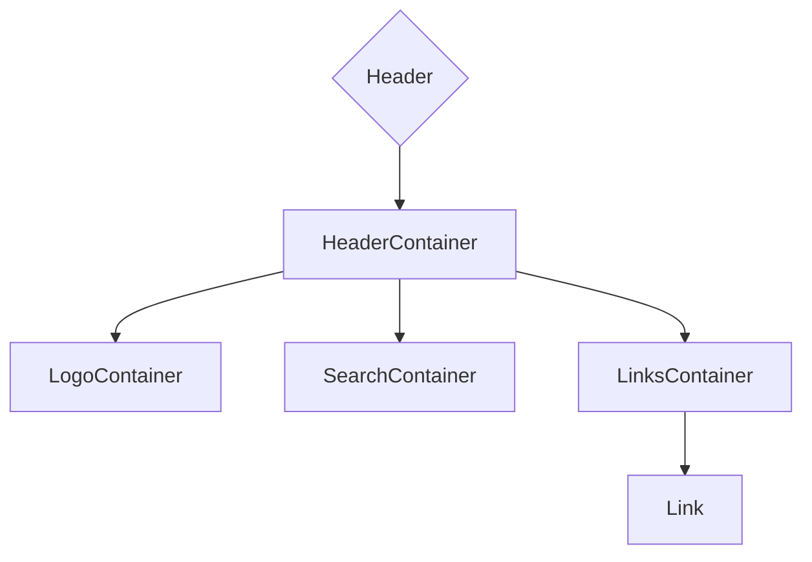

# @dictyBase/header

header Component library for dictyBase.

    
    <small><i>dictyBase header component with default data</i></small>

## Component architecture

```mermaid
graph TD
    A{Header} --> B[HeaderContainer]
    B --> B1[LogoContainer]
    B --> B2[SearchContainer]
    B --> B3[LinksContainer]
    B3 --> C[Link]
```
