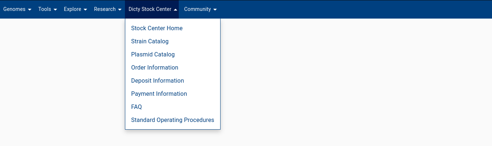
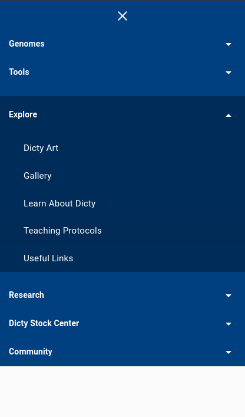
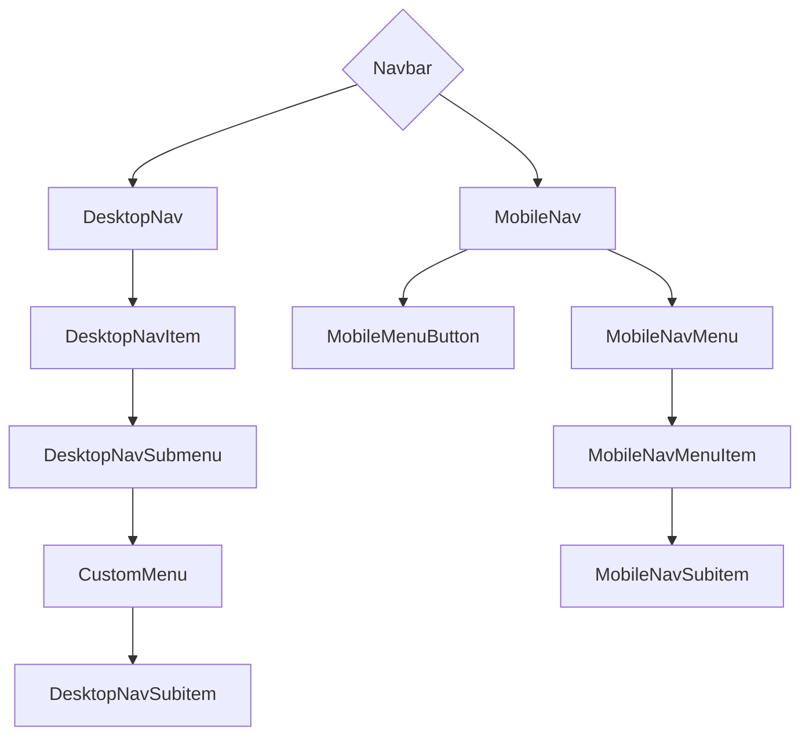

# @dictyBase/navbar

navbar Component library for dictyBase. This component works on both mobile and desktop screens.

    
    <small><i>dictyBase navbar component with default data, on a desktop screen</i></small>

    
    <small><i>dictyBase navbar component with default data, on a mobile screen</i></small>

## Component architecture

